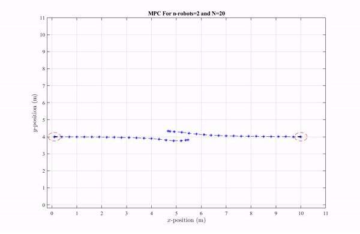
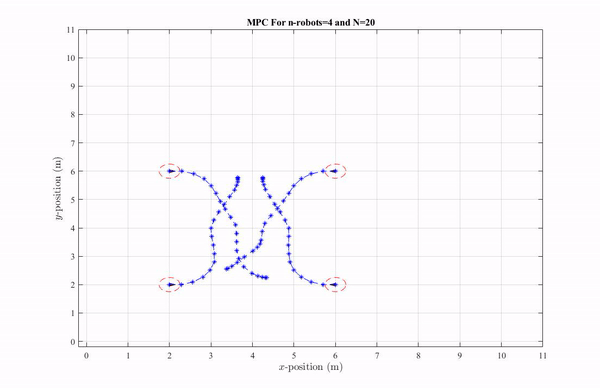
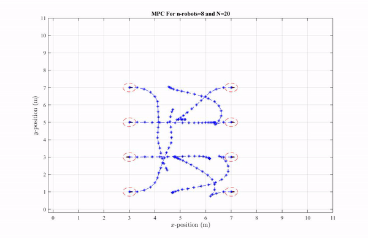

# Online-Trajectory-Generation-With-MPC-for-Non-Holonomic-Robots
Working on model predictive control  to control a group of multiple mobile robots and generate online trajectories in real time while avoiding collision with static point obstacles and other robots. On-demand Collision avoidance method is used to avoid collision and a replanning strategy is to be used to avoid disturbances to the system.

# Tasks completed in this Project are as follows:
1. Developed MATLAB code for N number of agents to transverse in a given space. And Made a comparison between velocity and acceleration plots.
 

 
 
 

3. Achieved the task to implement the model predictive control up to two p3dx mobile robots. Currently working on turtlebot3 waffle pi robot.
Further, this work will be extended to deal with any disturbances to the agents.
